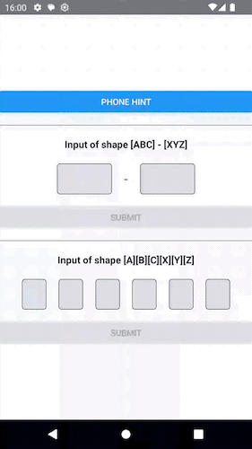

# React Native OTP Receiver

- [React Native OTP Receiver](#react-native-otp-receiver)
  - [Introduction](#introduction)
  - [Supported Versions](#supported-versions)
  - [Installation](#installation)
  - [Usage](#usage)
    - [low-level usage (Android only)](#low-level-usage-android-only)
      - [`onSMSReceived`](#onsmsreceived)
      - [`expectSMSWithOTP`](#expectsmswithotp)
      - [`requestPhoneHint`](#requestphonehint)
    - [high-level usage](#high-level-usage)
      - [With `OTPProvider`](#with-otpprovider)
        - [**Props**](#props)
      - [With `OTPInputHandler`](#with-otpinputhandler)
        - [**Props**](#props-1)
      - [OTPInputCell](#otpinputcell)
        - [**Props**](#props-2)
  - [Generating app hash](#generating-app-hash)
  - [Message content](#message-content)
    - [Android](#android)
    - [iOS](#ios)
  - [iOS shortcomings](#ios-shortcomings)
  - [Contributing](#contributing)
  - [License](#license)

## Introduction

This package handles receiving and filling OTP from SMS message. While automatically filling the input from incoming SMS is only available for Android, we handle user pressing the autofill button on iOS keyboard. 

> [!IMPORTANT]  
> For everything to work correctly, you must send SMS in [correct format](#message-content) and setup [associated domains](#ios) for iOS

| Android | iOS |
| --- | --- |
|  |  |

## Supported Versions

This libs is currently available only for the new arch.

## Installation

```sh
yarn add @pavelgric/react-native-otp-receiver
```

## Usage

We offer various ways of integration, what could be call *low-level* and *high-level*.

In *low-level*, you can use methods exported for Android to capture incoming SMS and handle iOS your own way

In *high-level* you use one of the prepared components (you are still responsible for rendering the UI) to easily access and render the OTP. This also has iOS integration ready.

### low-level usage (Android only)

This works in two steps. You register a listener for incoming SMS and then call a method that you are expecting a SMS.

#### `onSMSReceived`

A listener for incoming SMS.

```ts
import { onSMSReceived } from 'react-native-otp-receiver';

useEffect(() => {
  const listener = onSMSReceived((sms: SMSData) => {
    // handle the oncoming sms
  });
  return () => {
    listener.remove();
  };
}, []);
```

the listener receives SMSData with:

```ts
{
  message?: string;
  error?: string;
}
```

The error could be because of timeout, see [`expectSMSWithOTP`](#expectsmswithotp)

#### `expectSMSWithOTP`

After calling this function, you will get notified about incoming message via the [`onSMSReceived`](#onsmsreceived) listener. SMS must be [correctly formatted](#message-content), otherwise you won't receive it from the `onSMSReceived`. 

There is a time window to receive the message (around 5 mins) after calling `expectSMSWithOTP`, after this time window passes, `onSMSReceived` will receive `"error": "TIMEOUT"`, after that no message will be captured and you may want to start `expectSMSWithOTP` again.

After calling `expectSMSWithOTP`, the `onSMSReceived` will capture only one message. If it's not the message you expected, call `expectSMSWithOTP` again (but for this to happen, user would have to receive SMS containing the app hash at end, it doesn't matter if user receives any other SMS).

```ts
import { expectSMSWithOTP } from 'react-native-otp-receiver';

const res = await expectSMSWithOTP()
// the res is boolean indicating whether the listener was started successfully
```

#### `requestPhoneHint`

Calling this function will display prompt for user to select his phone number.

```ts
import { requestPhoneHint } from 'react-native-otp-receiver';

const res = await requestPhoneHint()
// the res is a string containing the phoneNumber. This call may fail (e.g. user dismisses the prompt)
```

### high-level usage

We try to assume as little as possible about what your code looks like and you should be able to configure following components to your needs.

#### With `OTPProvider`

##### **Props**

| Prop | Required | Type | Description | Default |
|---|---|---|---|---|
| codeInputShape | **Yes** | number[] | Shape for the code input. Number values in the array say how many characters are in each input cell.<br>E.g. [1,1,1,1] is 4 cells with single char in each cell. <br>[3, 3] are 3 chars in two cells | - |
| CodeInputCellComponent | **Yes** | Component\<CodeInputCellComponentProps> | The UI component to render as an input cell | - |
| children | **No** | `ReactNode` | The UI to render | - |
| onCodeEntered | No | `(data: OnCodeEnteredData) => void` |Function called after user fills in the code in it's full length | - |
| onSubmitCode | No | `(data: OnSubmitCodeData) => void;` | Function called after user fills in the code in it's full length. In this callback you should do your code validation | - |
| parseSMS | No | `(sms: string) => string \| null \| undefined` | (Android only) Function called when user receives the SMS and expects you to return the code extracted from it | - |
| expectSMSOnMount | No | boolean | Whether to automatically call `expectSMSWithOTP`. If not set to true, you must call `expectSMSWithOTP` manually | - |
| value | No | string | Use to set the code input value manually | - |
| parseEnteredCodeChar | No | `(char: string) => string` | Modify the entered char that user enters via keyboard. E.g. to capitalize it | - |
| parsePastedCode | No | `(code: string, codeInputShape: number[]) => string[];` | When user pastes copied (or suggested) value, here you can parse the value into input cells. E.g. to parse `ABC-XYZ` into `['ABC', 'XYZ']` | Function that separates string into the input shape |
| validateCodeChar | No | CodeCharValidator | Each time the code changes, you can validate it. This code runs for each entered character. E.g. to only accept numbers | - |

Example:

```tsx
import { View, Button } from 'react-native';
import { OTPInputCell, OTPProvider } from 'react-native-otp-receiver';
import { useOTPContext } from '../../src/components/OTPProvider';
import styles from './styles';

const getCodeFromSMS = (sms: string) => {
  // find 6 digit code
  return sms.match(/\d{6}/)?.[0] || '';
};

export default function OTPProviderExample() {
  return (
    <OTPProvider
      codeInputShape={[1,1,1,1]} // 4 cells, each holds single char
      onCodeEntered={(code) => { /*  */ }}
      onSubmitCode={(data) => { /*   */}}
      parseSMS={getCodeFromSMS}
    >
      <CodeInputRenderer />
    </OTPProvider>
  );
}

function CodeInputRenderer() {
  const { codeInputs, isCodeValid, submitCode } = useOTPContext();

  return (
    <>
      <View style={styles.otpContainer}>
        {codeInputs.map((index) => {
          return <CodeInputComponent key={index} index={index} />;
        })}
      </View>
      <Button title="Submit" disabled={!isCodeValid} onPress={submitCode} />
    </>
  );
}

function CodeInputComponent({ index }: { index: number }) {
  return <OTPInputCell index={index} />;
}
```

[Full example](./example/src/OTPProviderExample.tsx) in the example app


#### With `OTPInputHandler`

Wraps the `OTPProvider`, some may prefer this implementation over using the provider.

##### **Props**

[Provider props](#props-1) and:

| Prop | Required | Type | Description |
|---|---|---|---|
| children | **Yes** | `(props: RenderProps) => ReactNode` | The UI to render |

Example:

```tsx
import { View, Button, TouchableOpacity } from 'react-native';
import {
  OTPInputHandler,
  OTPInputCell,
  type CodeInputCellComponentProps,
} from 'react-native-otp-receiver';
import styles from './styles';

const getCodeFromSMS = (sms: string) => {
  return sms.match(/\d{6}/)?.[0] || '';
};

export default function OTPInputHandlerExample() {
  return (
    <OTPInputHandler
      codeInputShape={[1,1,1,1]}
      CodeInputCellComponent={CodeInputComponent}
      onCodeEntered={(code) => { /*  */ }}
      onSubmitCode={(code) => { /*  */}}
      parseSMS={getCodeFromSMS}
    >
      {({ renderOTPInput, submitCode, isValid }) => (
        <>
          <View style={styles.otpContainer}>{renderOTPInput()}</View>
          <Button title="Submit" disabled={!isValid} onPress={submitCode} />
        </>
      )}
    </OTPInputHandler>
  );
}

function CodeInputComponent(inputHandles: CodeInputCellComponentProps) {
  return <OTPInputCell {...inputHandles} />;
}
```

[Full example](./example/src/OTPHandlerExample.tsx) in the example app

#### OTPInputCell

The cell that handles input of the code value. It's a wrapper around `TextInput`

##### **Props**

TextInput props and:

| Prop | Required | Type | Description |
|---|---|---|---|
| index | **Yes** | number | Index of the input cell |

## Generating app hash

You can get the app hash by running this command `yarn react-native-otp-receiver get-app-hash`. It will ask you for package name, path to your keystore file and the keystore password.
This means you will have two separate app hashes, one for debug and one for production key.

## Message content

### Android

SMS must include [app-hash](#generating-app-hash) at the end of the message, otherwise you won't receive it from the `onSMSReceived`. Other than that, the message content may be anything. It is up to you to retrieve the code value from the message content, based on what you send.

Example:

```text
Your verification code is 123456

GawQ12fcSiS
```

### iOS

You must set up associated domains for your app and add it to the SMS content. Than the message content must by as they say in [apple docs](https://developer.apple.com/documentation/security/enabling-autofill-for-domain-bound-sms-codes)
> You can present any information at the start of the SMS message, in any format.
> The last line of your message needs your DNS domain name, prefixed by an at sign (@), and the one-time code, prefixed by a hash symbol (#). Separate the two components using a space. For example:

After receiving this SMS, user will will see a suggestion above their keyboard to fill this code. If you use *high-level* usage, pressing this code will be captured and filled automatically.

Example:

```text
Your Example code is 123456.


@example.com #123456
```

## iOS shortcomings

iOS doesn't have API for neither [reading received SMS messages](https://stackoverflow.com/questions/16187841/read-sms-message-in-ios), nor to [get own phone number](https://stackoverflow.com/questions/40719247/how-to-get-own-mobile-number-from-the-ios-device-programmatically)

## Contributing

See the [contributing guide](CONTRIBUTING.md) to learn how to contribute to the repository and the development workflow.

## License

MIT

---

Made with [create-react-native-library](https://github.com/callstack/react-native-builder-bob)
